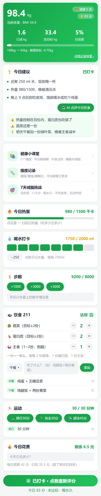
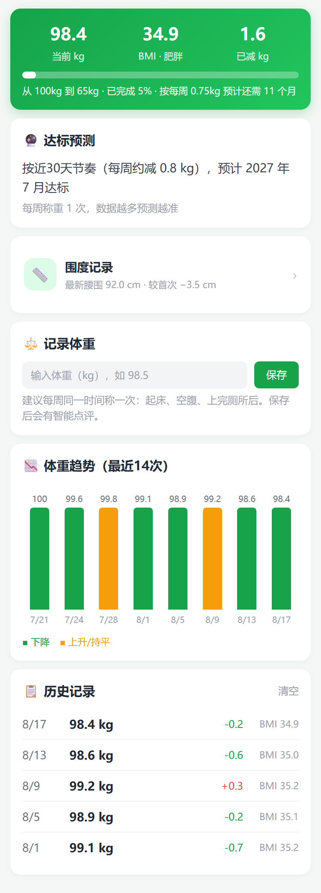
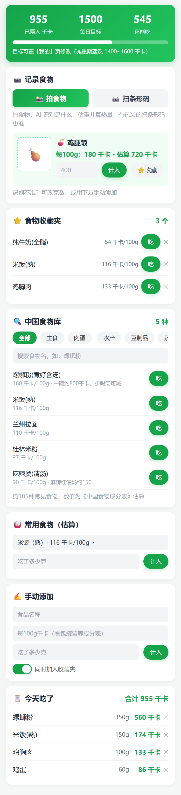
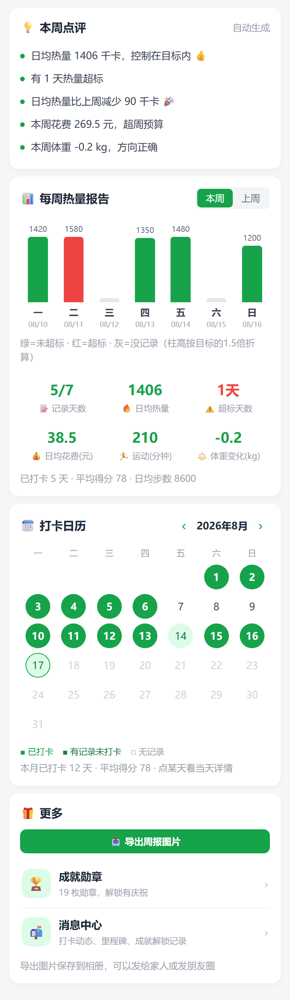
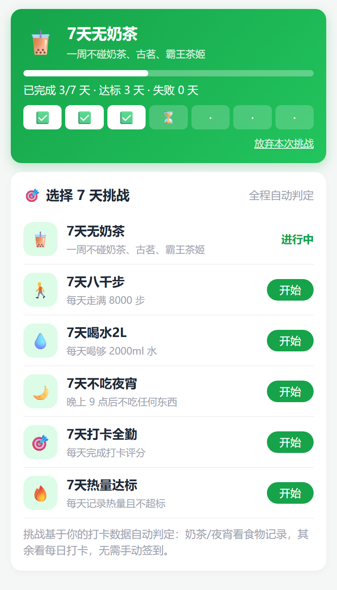
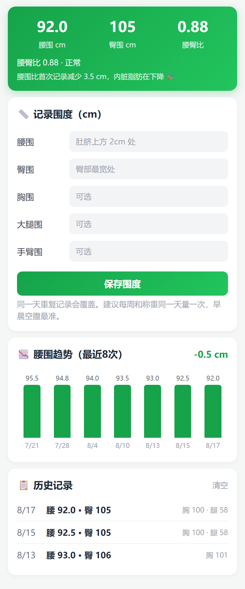
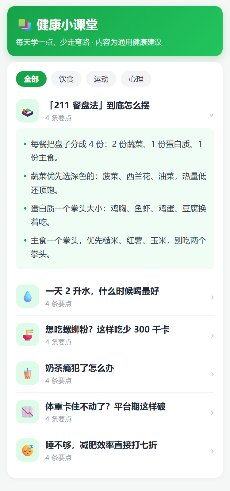
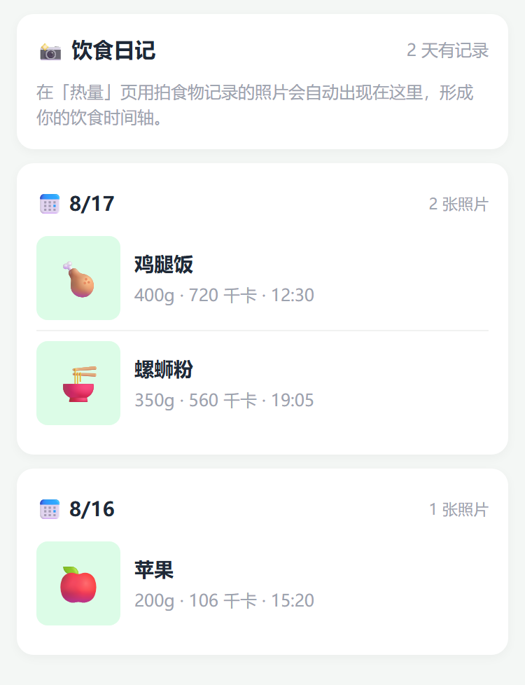

# 减重打卡 · 微信小程序

> 📱 一款「APP 级体验」的个人减重管理微信小程序 —— 记录每一天，遇见更好的自己。

   

## ✨ 功能亮点

| 模块 | 说明 |
|---|---|
| 🤖 **AI 双能力** | 📸 拍食物自动识别（判断食物+估算克重+算热量）+ 🤖 拍整餐点评 + 每日饮食 AI 教练点评（三段式建议） |
| ⚖️ **体重管理** | 体重/BMI 趋势图、**体重·腰围同图对比**（平台期看腰围）、达标日期预测、智能点评、里程碑庆祝 |
| 📏 **围度记录** | 腰围/臀围/腰臀比健康评级、围度趋势（体重不动时围度告诉你脂肪在减） |
| 🔥 **热量账本** | 扫码查热量（Open Food Facts）、185 种中国食物库（分类芯片+搜索）、快捷分量选择、吃前智能预警、食物收藏夹 |
| 📊 **数据报告** | 自动周报点评（对比上周）、周柱状图、打卡日历、周报图片导出（存相册）、**每周一微信推送周报总结** |
| 🎯 **7 天挑战赛** | 无奶茶/八千步/喝水2L/不吃夜宵/打卡全勤/热量达标 —— 全程自动判定，无需手动签到 |
| 🏆 **成就系统** | 19 枚勋章（首日打卡→达成目标），解锁即庆祝 |
| 📸 **饮食日记** | 拍食物记录的照片自动生成时间轴 |
| ☁️ **云端全家桶** | 微信登录（openid 账号体系）、多设备云同步、家人组互相监督、订阅消息提醒（喝水/称重/周报） |
| 📚 **健康小课堂** | 12 篇行为科学内容（211餐盘/平台期破解/外食法则/睡眠与减脂…） |
| 🎨 **体验** | 深色模式、胶囊按钮、入口行交互、喝水达标动画、新手三步引导 |

## 📱 界面预览

| 今日 | 体重 | 热量 | 报告 |
|---|---|---|---|
|  |  |  |  |

| 挑战 | 围度 | 课堂 | 日记 |
|---|---|---|---|
|  |  |  |  |

（完整 12 张预览图见 `docs/preview/`）

## 🚀 快速开始

### 环境要求
- 微信开发者工具（[下载](https://developers.weixin.qq.com/miniprogram/dev/devtools/download.html)）
- 微信小程序 AppID（[注册](https://mp.weixin.qq.com)，个人主体免费）
- 微信云开发环境（免费额度）
- （AI 功能可选）智谱 AI 开放平台 API Key（[注册](https://open.bigmodel.cn)，GLM-4V-Flash 免费）

### 三步跑起来
1. **导入项目**：开发者工具「导入项目」→ 选择本目录 → 填 AppID（`project.config.json` 可改）→ **后端服务选「微信云开发」**
2. **配置云开发**：`utils/config.js` 填 `cloudEnv`（云开发环境 ID）
3. **部署云函数**：右键 `cloudfunctions/` 下 5 个文件夹（login/family/reminder/vision/ai）→「上传并部署：云端安装依赖」；`reminder` 再右键「上传触发器」

> 📖 从注册到发布的**完整 6 步图文流程**、审核文案、常见报错速查，见 [`上线手册.md`](上线手册.md) 与 [`上线材料包.md`](上线材料包.md)。

## 🗂️ 项目结构

```
├── app.js / app.json / app.wxss     # 全局配置（入口为登录页，深色模式 theme.json）
├── cloudfunctions/                  # 云函数
│   ├── login/                       # 微信登录（openid）
│   ├── family/                      # 家庭组监督
│   ├── reminder/                    # 订阅提醒 + 周报自动生成（定时触发器）
│   ├── vision/                      # 拍照识别食物 + AI 点评（GLM-4V）
│   └── ai/                          # 每日饮食 AI 点评（GLM-4-Flash）
├── data/                            # 中国食物库（185种）+ 健康小课堂（12篇）
├── utils/                           # 工具模块（智能建议/成就/云同步/认证/提醒/挑战/导出）
├── pages/                           # 14 个页面（登录/今日/体重/热量/报告/我的/成就/消息/围度/课堂/挑战/日记/协议）
└── docs/preview/                    # 界面预览图
```

## 🧪 测试

4 套自动化测试，**218 项断言全部通过**：

```bash
node tests/run_tests.js       # 工具模块逻辑（39 项）
node tests/run_pages.js       # 14 个页面真实交互冒烟（96 项，模拟 wx API）
node tests/run_cloud.js       # 云函数 + 云端客户端（52 项，模拟 wx-server-sdk）
node tests/static_check.js    # 静态检查（31 项：页面完整性/跳转URL/WXML配对/WXSS/密钥）
```

测试支持指定项目路径：`$env:MP_SRC="你的项目目录"`。

## 🔒 安全说明

- **API Key 不入库**：智谱 Key 放在 `cloudfunctions/vision/key.local.js` 与 `cloudfunctions/ai/key.local.js`（已被 `.gitignore` 排除），部署云函数时随文件夹上传云端使用。
- 数据默认本地存储；开启云同步后加密传输至微信云开发数据库；家人组仅共享昵称与打卡摘要。

## 📜 版本历史

| 版本 | 更新 |
|---|---|
| v2.0.0 | 体重·腰围对比图、周报订阅推送 |
| v1.9.0 | 饮食拍照日记、围度对比摘要、跳转URL校验 |
| v1.8.0 | AI 拍整餐点评、7 天减脂挑战赛、喝水达标动画 |
| v1.7.0 | AI 饮食点评、围度记录、健康小课堂 |
| v1.6.0 | 拍照识别食物、快捷分量选择、入口行交互重构 |
| v1.5.1 | 云同步/家人/提醒/成就/消息/周报导出/深色模式 |
| v1.4.0 | APP 规范账号体系（登录/协议/资料/退出） |

## ⚠️ 免责声明

本项目为个人健康打卡记录工具，内置内容均为通用健康建议，**不构成医疗建议**。如有身体不适，请及时就医。
